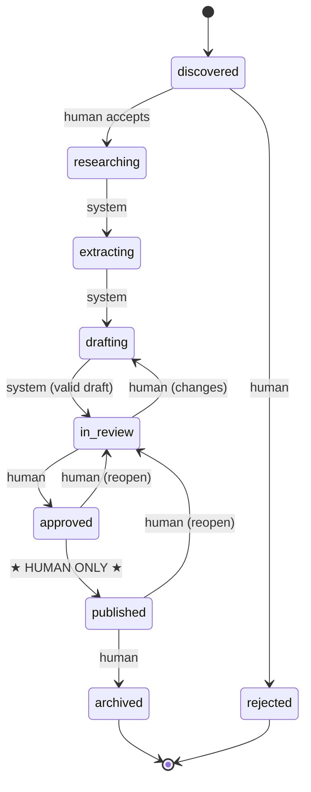
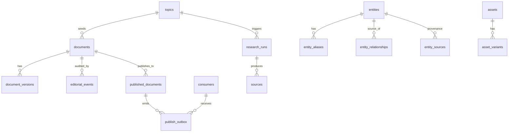

# DOMAIN MODEL — Arsyen Research

The single source of canonical vocabulary and enumerations. When a task needs the list of valid statuses, block types, entity types, etc., **read it here** rather than re-deriving it. Anything added here is additive to the contract — extend deliberately.

---

## 1. Glossary

| Term | Definition |
|---|---|
| **Document** | A unit of editorial output (article, essay, …). Has a stable `documentId` and a chain of immutable versions. |
| **Document version** | An immutable snapshot of a document's content at one point. The published doc *is* a specific version. |
| **Block** | An ordered, typed unit of a document's body (paragraph, image, timeline, …) with a stable `id`. |
| **Span** | A run of text within a rich-text block, optionally carrying marks and refs. |
| **Mark** | Inline formatting on a span (closed set). |
| **Ref** | A rich annotation on a span — a link or an entity reference. |
| **Reference** | A document-level, deduped pointer to a knowledge-graph entity, carrying a denormalized **snapshot** + canonical `entityId` + provenance `source`. |
| **Snapshot** | The denormalized copy of reference/asset data embedded in a published document so it is self-contained (Invariant 3). |
| **Asset** | A media descriptor (image/video/audio) with a **semantic role**, variants, and metadata — never layout (Invariant 1). |
| **Variant** | A derived rendition of an asset (a width + format). |
| **Entity** | A node in the knowledge graph (film, artist, book, …). Canonical, human-confirmed. |
| **Relationship** | A directed, typed edge between two entities. |
| **Topic** | A candidate or in-progress subject that seeds the editorial pipeline. |
| **Research run** | One execution of the research stage for a topic, producing sources. |
| **Source** | A piece of collected research material with an embedding, used to ground drafts. |
| **taskClass** | The *kind* of model work an agent requests (reasoning, extraction, …); routed to a concrete model by config — agents never name a model (Invariant 5). |
| **Agent** | A stateless workflow (Research/Extraction/Writing/Verification/Atomization) that runs as a job and calls the Model Gateway. |
| **Model Gateway** | The single model-agnostic facade; the only code that knows a provider exists. |
| **Consumer** | An external system (arsyen.blog, Feed, …) that reads published documents and/or receives publish webhooks. |
| **Outbox** | The transactional table of publish events awaiting delivery to consumers. |
| **Correlation ID** | The trace id threaded from a topic through every job to publish, for observability. |

---

## 2. ID scheme

Prefixed, k-sortable TypeIDs (see `ENGINEERING_GUIDE §1`). Prefix → entity:

`doc_` document · `dv_` document_version · `blk_` block · `ref_` reference · `ent_` entity · `asset_` asset · `topic_` topic · `run_` research_run · `src_` source · `evt_` editorial_event · `cns_` consumer · `usr_` user.

IDs are opaque to consumers; **slugs** are the human/URL-facing identifiers and live in `metadata`.

---

## 3. Enumerations

### `documentType`
`article` · `essay` · `interview` · `reference` · `list`

### `documentStatus`
`discovered` · `researching` · `extracting` · `drafting` · `in_review` · `approved` · `published` · `archived` · `rejected`
(Full transition rules in §4.)

### Block `type` (v1 catalog — additive only)
`paragraph` · `heading` · `quote` · `image` · `filmReference` · `artistReference` · `bookReference` · `albumReference` · `gallery` · `comparison` · `timeline` · `list` · `divider` · `callout` · `embed`
*Unknown types must validate as pass-through and render as graceful fallback (Invariant 2).*

### `mark` (closed set — do NOT extend without a contract major bump)
`strong` · `em` · `code` · `strike` · `underline`

### `ref` type (span annotations)
`link` (`{ href }`) · `reference` (`{ referenceId }`)

### `entityType`
`film` · `artist` · `book` · `album` · `movement` · `concept` · `person`

### `relation_type` (starter vocabulary — extensible; add deliberately)
`directed_by` · `influenced_by` · `belongs_to_movement` · `scored_by` · `wrote` · `starred_in` · `released_in` · `part_of` · `references` · `contemporary_of`

### Asset `kind` / `role`
- **kind:** `image` · `video` · `audio`
- **role (semantic, never layout):** `hero` · `inline` · `gallery` · `comparison` · `thumbnail` · `poster`

### `taskClass` (Model Gateway routing)
| taskClass | Typical use | Routed to (via `model-policy.json`) |
|---|---|---|
| `reasoning` | drafting, synthesis | a strong reasoning model |
| `fast_summarize` | source summaries, cheap passes | a fast/cheap model |
| `extraction` | entity/relationship extraction (structured) | a structured-output model |
| `embedding` | source/entity embeddings | an embedding model |

### Outbox `event_type`
`document.published` · `document.updated` · `document.unpublished`

### Editorial `event_type` / actor format
- Actor strings: `human:<usr_…>` · `agent:<name>` · `system`.
- The `approved → published` transition accepts **only** a `human:` actor (Invariant 4, enforced in `T-034`).

---

## 4. Document state transition table (authoritative)

This table **is** the spec for the state machine in `T-034`. A transition not listed is illegal and must be rejected. "Trigger" is the actor permitted to cause it.

| From | To | Trigger | Notes |
|---|---|---|---|
| `discovered` | `researching` | **human** (accept topic) | system then enqueues the research job |
| `discovered` | `rejected` | **human** | topic declined |
| `researching` | `extracting` | system | research job complete |
| `extracting` | `drafting` | system | extraction complete; entity *proposals* are staged for a separate human-confirm KG merge (`T-092`) — this does **not** block drafting |
| `drafting` | `in_review` | system | Writing agent produced a **schema-valid** draft |
| `in_review` | `drafting` | **human** (request changes) | revise loop; Verification flags are advisory annotations and do **not** change status |
| `in_review` | `approved` | **human** | editorial sign-off |
| `approved` | `in_review` | **human** (re-open) | optional |
| `approved` | `published` | **★ human ONLY ★** | the single human-gated publish; triggers resolve-snapshots + transactional outbox (`T-036`) |
| `published` | `archived` | **human** | unpublish |
| `published` | `in_review` | **human** (re-open to edit) | a re-publish is required afterward; published history stays immutable |
| any non-terminal | `rejected` | **human** | kill switch |

Terminal-ish states: `published` (live), `archived`, `rejected`. No agent or system actor may reach `published` — the guard in `T-034` rejects non-`human:` actors on that edge.

### Workflow (Mermaid)

---

## 5. Data model at a glance

Which tables exist and how they relate (full DDL in `ARCHITECTURE.md §7`). Stores are split by access pattern within one Postgres instance.

- **Editing side** (mutable, normalized): `topics`, `documents`, `document_versions`, `editorial_events`.
- **Published side** (immutable, denormalized, read-heavy): `published_documents`, `publish_outbox`, `consumers`.
- **Knowledge graph** (canonical, human-confirmed): `entities`, `entity_aliases`, `entity_relationships`, `entity_sources`.
- **AI/research**: `research_runs`, `sources` (with embeddings), `ai_calls` (cost ledger).
- **Assets**: `assets`, `asset_variants`.

The document *content envelope* lives as `jsonb` inside `document_versions.content` and `published_documents.content` — validated by `content-schema`, not mapped to columns.
